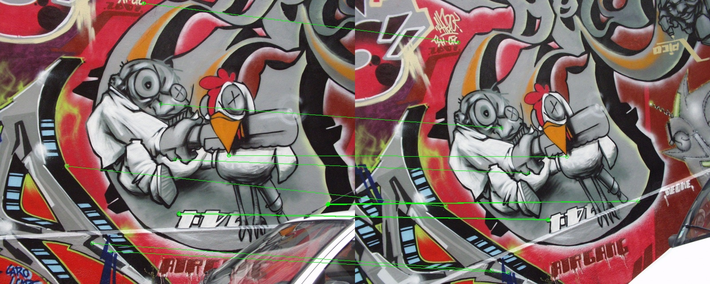
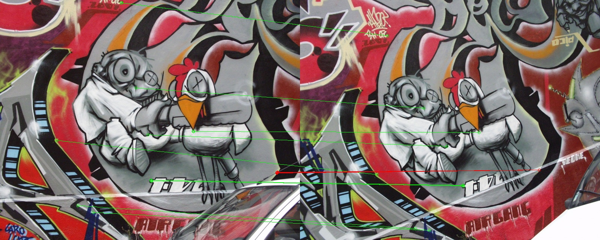

# Computer Vision Assignment: Feature Detection, Matching, and Deep Learning Methods

## Overview
This assignment provides hands-on experience in both traditional computer vision techniques and deep learning methods for image matching. The project is divided into two primary sections: (1) traditional methods for feature detection, description, and matching, and (2) deep learning-based Siamese networks for image matching. You will implement algorithms from both paradigms and compare their effectiveness in solving image matching tasks.

## Learning Objectives
- Understand and implement the Harris corner detector
- Learn about scale and rotation invariant feature descriptors (SIFT/SURF)
- Implement RANSAC for robust feature matching
- Design and train Siamese networks for image matching
- Compare traditional and deep learning approaches
- Visualize matching results and evaluate matching quality

## Dataset
- Image pairs from [Kaggle's Panorama dataset](https://external-site.com) or any suitable source with varying degrees of viewpoint changes.
- Oxford5k dataset for landmark image matching experiments (available on Canvas: image.zip).

## Skeleton Codes
- GitHub: [Computer Vision Assignment: Feature Detection, Matching, and Deep Learning Methods](https://external-site.com)

## Timeline
- Release date: Apr 15, 2025
- Submission deadline: May 5, 2025

## Assignment Structure

### Part 1: Traditional Methods (50%)

#### Part 1A: Harris Corner Detector
You will implement the Harris corner detector to identify key interest points in an image. This part involves computing gradients, structure tensors, and applying non-maximum suppression to extract the strongest corner points. You will also visualize the detected corners on the original image.

**Requirements:**
- Implement gradient computation using Sobel operators
- Compute the structure tensor for each pixel
- Apply non-maximum suppression to identify corners
- Allow parameter adjustment (e.g., corner response threshold, window size)
- Visualize the corners detected on sample images

#### Part 1B: Feature Description (SIFT/SURF)
In this section, you will use OpenCV's implementation of either SIFT (Scale-Invariant Feature Transform) or SURF (Speeded-Up Robust Features) to describe features in the image. You will experiment with different parameter settings and analyze the effects of these settings on feature matching.

**Requirements:**
- Use OpenCV's implementation of SIFT or SURF to extract feature descriptors
- Experiment with different parameters and observe their impact on keypoint detection and feature description
- Visualize keypoints with orientation and scale information
- Compare the performance of SIFT and SURF in terms of accuracy and speed
- Document the theoretical background of the chosen feature descriptor

#### Part 1C: Feature Matching with RANSAC
You will implement a feature matching pipeline that pairs features between two images. RANSAC (Random Sample Consensus) will be used to compute a robust homography matrix that transforms one image to align with another. This section will also include a ranking metric to evaluate matching quality.

**Requirements:**
- Implement a distance metric (e.g., Euclidean distance) for descriptor matching
- Apply Lowe's ratio test to filter out ambiguous matches
- Implement RANSAC to estimate the homography matrix
- Visualize image matches both before and after applying RANSAC
- Implement a match quality evaluation metric to rank the best and worst matches

Please ensure you obtain one additional image from the Panorama dataset for testing.

#### Demo Results

| **Task**                  | **Description**                                   | **Figure**                                                                 |
|---------------------------|---------------------------------------------------|----------------------------------------------------------------------------|
| Harris Corner Detection   | Visualization of detected corners on sample image |                               |
| SIFT Keypoints            | Keypoints detected using SIFT with orientation    |                               |
| Feature Matching (Before) | Matches before applying RANSAC                   |             |
| Feature Matching (After)  | Matches after applying RANSAC                    |               |


#### Bonus (10%): Implementing Homography for Image Alignment
In this bonus section, you will implement homography-based image alignment using the feature matches obtained from Part 1C. Homography refers to the transformation that relates the points in one image to the corresponding points in another image, allowing for the alignment or warping of the second image to match the first one. This is particularly useful in tasks such as image stitching and panorama creation.

**Objective:** You will implement a method to compute a homography matrix using the feature matches and apply this transformation to align one image with another.

**Steps to Complete:**

*Homography Calculation:*
- After obtaining feature matches between two images (using SIFT/SURF and RANSAC as previously implemented), you will compute the homography matrix that maps points from the first image to the second.
- The homography matrix can be computed using the Direct Linear Transformation (DLT) method or via an OpenCV function like cv2.findHomography.
- Ensure that the matches used are robust, meaning that you should apply RANSAC to find the homography matrix in a way that is resistant to outliers.

*Image Alignment:*
- Once you have the homography matrix, you will use it to warp one image onto the other, aligning them based on the matched feature points.
- You can apply the homography transformation using the cv2.warpPerspective() function, which will align the second image to the perspective of the first image.

*Visualization:*
- Display the aligned image alongside the original one to visualize the result of the alignment. The alignment should be evaluated by observing how well the features in both images correspond to each other after the transformation.
- You should also visualize the matched points on both images before and after applying the homography transformation to show the effectiveness of the alignment.

### Part 2: Siamese Networks for Image Matching (50%)
In this section, you will design and implement a Siamese network for image matching, utilizing deep learning techniques. The network will take pairs of images as input and output a similarity score, which indicates whether the images are similar or not.

#### Siamese Network Architecture Description
You will use a modified version of ResNet18 as the backbone for the Siamese network. This architecture involves processing two input images through the same network, extracting feature vectors, concatenating them, and predicting a similarity score using fully connected layers.

**Requirements:**
- Implement a Siamese Network architecture using ResNet18 as the backbone
- Modify the ResNet18's first convolutional layer to accept RGB images (3 channels)
- Remove the final classification layer to obtain feature vectors
- After extracting features for both images, concatenate these vectors and apply fully connected layers to predict similarity
- Use Binary Cross-Entropy (BCE) loss to train the network

**Training and Evaluation Tips:**
- Load image pairs from the dataset and preprocess them (e.g., resize and normalize)
- Use balanced batches of similar and dissimilar pairs for training
- During training, use a suitable device (CPU/GPU), calculate the loss, and perform backpropagation
- Track and log the metrics (e.g., accuracy, loss) during training
- Use Weights & Biases (wandb) for visualizing training progress

#### Implementing and Testing the Siamese Network:
In `part2/model.py`:
- Implement the Siamese Network architecture
- Ensure the network outputs a similarity score using BCE loss

In `part2/main.py`:
- Implement the training loop, data loading, and evaluation procedure
- Track statistics and periodically evaluate the model
- Save model checkpoints and visualize results

#### Bonus (10%): Contrastive and Triplet Losses
In this bonus section, you will experiment with two alternative loss functions, Contrastive Loss and Triplet Loss, to train your Siamese network. Both of these loss functions are designed to improve the performance of image similarity tasks by encouraging the network to learn better representations of similarity.

**Requirements:**

1. **Contrastive Loss Implementation (5%):**

   **Objective:** Contrastive loss aims to minimize the distance between positive image pairs (similar images) and maximize the distance between negative image pairs (dissimilar images).

   **How it works:**
   - The network receives two input images and predicts whether they are similar or dissimilar
   - For positive pairs (similar images), the loss function encourages the network to bring the feature vectors closer
   - For negative pairs (dissimilar images), the loss function pushes the feature vectors farther apart
   - The loss function formula is typically:

     L(A,B,y) = y * d(A,B)² + (1-y) * max(margin - d(A,B), 0)²

     where:
     - d(A,B) is a distance metric (e.g., Euclidean distance)
     - y is the label (1 for similar, 0 for dissimilar)
     - Margin is a hyperparameter that defines the minimum distance for dissimilar pairs

   **Why contrastive loss might perform better than BCE loss:**
   - Binary Cross-Entropy (BCE) loss only focuses on binary classification (similar or dissimilar), but contrastive loss encourages the model to learn a continuous similarity score, resulting in more nuanced feature representations
   - Contrastive loss encourages better separation between similar and dissimilar pairs, which can lead to more robust similarity predictions, especially when fine-grained distinctions between images are important

   **Task:** Implement the contrastive loss in the Siamese network and train the model. Write a short explanation of why you believe contrastive loss might outperform BCE loss for this task, based on its structure and objectives.

2. **Triplet Loss Implementation (5%):**

   **Objective:** Triplet loss builds on the idea of embedding three images together: an anchor image, a positive image (similar to the anchor), and a negative image (dissimilar to the anchor). The loss function encourages the anchor image to be closer to the positive image and farther from the negative image in the feature space.

   **How it works:**
   - The network takes three images as input: anchor, positive, and negative
   - The loss function encourages the feature vector of the anchor to be closer to the positive (similar) image and farther from the negative (dissimilar) image, using a margin to ensure sufficient separation
   - The loss function formula is:

     L(A,P,N) = max(d(A,P) - d(A,N) + margin, 0)

     where:
     - d(A,B) is a distance metric (e.g., Euclidean distance)
     - Margin ensures that the negative image is sufficiently farther away from the anchor than the positive image

   **Task:** Implement triplet loss as an alternative to contrastive loss and evaluate its effectiveness by comparing performance in terms of similarity prediction and accuracy. This is optional, but you are encouraged to experiment with it for further learning.

**Evaluation and Comparison:**
- **Contrastive Loss vs. BCE Loss:** After implementing contrastive loss, compare its performance with Binary Cross-Entropy loss in terms of training stability, convergence speed, and similarity prediction accuracy. Provide insights into why contrastive loss might work better for your image matching task.
- **Triplet Loss Evaluation:** If you implement triplet loss, evaluate how it compares with both BCE and contrastive loss. Consider the following:
  - How does the model perform on unseen data?
  - Which loss function leads to the best separation between similar and dissimilar images in the feature space?
  - How does triplet loss handle harder negative samples compared to contrastive loss?

## Tasks to finish

### Part 1: Traditional Methods
Your task is to complete the implementation in the following files:

In `src/harris.py`:
- Implement gradient computation using Sobel operators
- Compute the structure tensor
- Calculate Harris corner response
- Apply non-maximum suppression

In `src/descriptors.py`:
- Initialize SIFT/SURF feature descriptor from OpenCV
- Implement keypoint detection and descriptor computation
- Convert Harris corners to keypoints

In `src/matching.py`:
- Implement descriptor matching with Lowe's ratio test
- Implement RANSAC for homography estimation
- Compute match quality score

### Part 2: Siamese Networks
Your task is to implement the Siamese network architecture and its training loop:

In `part2/model.py`:
- Implement a Siamese Network architecture using ResNet18 as the backbone
- The network should output a similarity score for image pairs using BCE loss

In `part2/main.py`:
- Implement the training loop
- Set up data loading and device placement
- Implement forward pass, loss calculation, and backpropagation
- Track statistics and periodically evaluate the model
- Save checkpoints and visualize results

## Siamese Network Architecture Description
Your Siamese Network implementation should follow this architecture:

**Feature Extraction Backbone:**
- Use ResNet18 as the feature extraction backbone
- Modify the first convolutional layer to handle RGB images (3 channels)
- Remove the final classification layer to extract feature vectors

**Feature Processing Pathway:**
- Process each input image through the same backbone network
- Extract feature vectors for both input images
- Concatenate the two feature vectors

**Similarity Prediction:**
- Add fully connected layers after concatenation (input_size*2 → 256 → 1)
- Apply ReLU activation after the first fully connected layer
- Apply Sigmoid activation at the output to get a similarity score (0-1)

**Weight Initialization:**
- Initialize weights with Xavier initialization
- Initialize biases with small positive values

## Training and Evaluation Tips

**Data Loading and Preprocessing:**
- Load image pairs from the dataset
- Apply appropriate transformations (resize, normalization)
- Create balanced batches of similar and dissimilar pairs

**Training Loop Implementation:**
- Iterate through epochs and batches
- Move data to the appropriate device (CPU/GPU)
- Perform forward pass to get similarity predictions
- Calculate BCE loss between predictions and ground truth
- Perform backward pass and optimization
- Track and log metrics

**Visualization and Logging:** (You can use GenAI to do this)
- Use Weights & Biases (wandb) to track and visualize training progress (Recommend to use this which will be really helpful in your future research)
- Log metrics such as loss, accuracy, precision, and recall
- Visualize example matches and mismatches periodically

## Implementation Details
- Programming language: Python
- Required libraries: NumPy, OpenCV, Matplotlib, PyTorch, wandb
- You must implement the Harris corner detector and RANSAC algorithm yourself
- You may use OpenCV for SIFT/SURF feature extraction
- You should implement the Siamese network architecture yourself

## Testing Your Implementation

### Part 1: Traditional Methods
You can test your implementation using the provided test script:

```
python test_assignment.py
```

This will run tests for each component and save the results as images.

Once you're confident in your implementation, you can run the full pipeline:

```
python main.py
```

### Part 2: Siamese Networks
Test your implementation with:

```
python main.py --action=train_test
```

## Running the Assignment
1. Download the Oxford5K dataset provided on Canvas and put it as `part2/images/<name>.jpg`
2. Place your image pairs in the data directory for part1
3. Run the main script for traditional methods:
   ```
   python main.py
   ```
4. Run the training and evaluation scripts for Siamese networks in part2:
   ```
   python main.py --action=train_test
   ```
5. Check the results directory for the output visualizations

## Evaluation Criteria
Your assignment will be evaluated based on:

**Part 1: Traditional Methods (50%)**
- Correctness of implementation for Harris detector (15%)
- Appropriate use and understanding of SIFT/SURF (15%)
- Quality of feature matching and RANSAC implementation (20%)

**Part 2: Siamese Networks (50%)**
- Correctness of implementation for Siamese network architecture (20%)
- Completeness and correctness of training loop (20%)
- Analysis of results and performance (10%)

## Submission Requirements
- Source code with clear documentation
- LaTeX report (PDF) containing:
  - Brief description of your implementation for both parts
  - Visualization of results at each stage
  - Analysis of Siamese network training
  - Comparison between traditional methods and Siamese network
  - Analysis of matching performance across different image pairs
  - Discussion of limitations and potential improvements
  - All experimental results with appropriate figures and tables

## Resources
- Lecture notes on feature detection and matching
- [Aggregating Deep Convolutional Features for Image Retrieval](https://www.cv-foundation.org/openaccess/content_iccv_2015/papers/Babenko_Aggregating_Local_Deep_ICCV_2015_paper.pdf)
- Harris & Stephens, "A combined corner and edge detector" (1988)
- Lowe, "Distinctive Image Features from Scale-Invariant Keypoints" (2004)
- Bay et al., "SURF: Speeded Up Robust Features" (2006)
- Fischler & Bolles, "Random Sample Consensus" (1981)
- Bromley et al., "Signature Verification using a Siamese Time Delay Neural Network" (1993)
- Chopra et al., "Learning a Similarity Metric Discriminatively, with Application to Face Verification" (2005)
- OpenCV documentation for SIFT and SURF implementations
- PyTorch documentation for deep learning implementation
- Weights & Biases documentation for experiment tracking

## Questions and Support
If you have any questions about the assignment, please contact the teaching assistants during office hours.