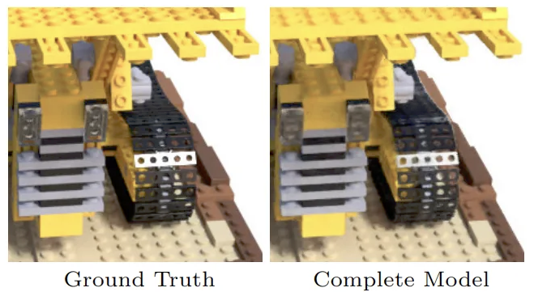

# Computer Vision Assignment: Neural Radiance Fields (NeRF) Implementation

## Overview

This assignment focuses on implementing Neural Radiance Fields (NeRF) from scratch. You will gain hands-on experience with one of the most influential 3D scene representation and novel view synthesis models in computer vision. The implementation will cover all critical components of the NeRF pipeline, including the MLP architecture, positional encoding, ray sampling, and volumetric rendering.

## Learning Objectives

- Understand the complete architecture of NeRF
- Implement positional encoding for representing high-frequency functions
- Create ray generation and sampling strategies
- Build volumetric rendering techniques
- Implement hierarchical sampling for efficient rendering
- Train and evaluate a novel view synthesis model on standard datasets
- Gain practical experience with PyTorch for 3D computer vision tasks

## Datasets

- Synthetic NeRF dataset (primary dataset)
- LLFF (Local Light Field Fusion) dataset (optional for extension)

## Timeline

- Release date: May 13, 2025
- Submission deadline: May 30, 2025

## Installation and Setup

### Prerequisites

- Python 3.8+
- PyTorch 1.10+
- CUDA-enabled GPU (required)
- NumPy, imageio, matplotlib

### Setup Environment

Reuse the previous environment and install the needed packages if errors show up.

### Dataset Preparation

The repository includes a script to download the necessary example data:

```bash
# Make the script executable
chmod +x download_example_data.sh

# Run the data download script
./download_example_data.sh
```

This will download the required datasets to the `data/` directory. The script includes examples from:
- Synthetic NeRF dataset (Blender objects like lego, chair, etc.)
- LLFF (Local Light Field Fusion) dataset (optional for extension)
- Other datasets as included in the original implementation

## Project Structure

```
nerf/
├── __pycache__/          # Python cache
├── configs/              # Configuration files
├── data/                 # Dataset directory (will be populated by download script)
├── logs/                 # Training logs and outputs
│   └── blender_paper_lego/ # Example experiment directory
├── download_example_data.sh # Script to download example datasets
├── LICENSE
├── load_blender.py       # Blender dataset loader
├── load_deepvoxels.py    # DeepVoxels dataset loader
├── load_LINEMOD.py       # LINEMOD dataset loader
├── load_llff.py          # LLFF dataset loader
├── README.md
├── requirements.txt      # Python dependencies
├── run_nerf_helpers.py   # Helper functions (contains many functions to implement)
└── run_nerf.py           # Main NeRF training and rendering code
```

## Assignment Tasks

For this assignment, you'll need to implement several key functions in the NeRF architecture. The main file structure is already provided, and you'll need to fill in the missing implementations.

### Part 1: Positional Encoding (15%)

Implement the positional encoding module in `run_nerf_helpers.py` that enables the MLP to represent high-frequency functions.

**Requirements:**
- Complete the `get_embedder` function that maps inputs to a higher dimensional space
- Implement both sinusoidal and cosinusoidal encoding
- Support different frequency bands for position and viewing direction

### Part 2: Neural Network Model (20%)

Implement the core NeRF MLP architecture in `run_nerf_helpers.py`.

**Requirements:**
- Complete the `NeRF` class implementation with skip connections
- Implement separate branches for density and color prediction
- Support view-dependent effects through directional inputs
- Ensure proper initialization of network weights

### Part 3: Ray Generation and Sampling (15%)

Implement ray generation from camera parameters and stratified sampling along rays in `run_nerf.py`.

**Requirements:**
- Complete the `get_rays` and `get_rays_np` functions to generate rays from camera parameters
- Implement stratified sampling along rays in the `render_rays` function
- Support transformations between camera and world coordinates
- Implement NDC (Normalized Device Coordinates) transformation for forward-facing scenes in the `ndc_rays` function

### Part 4: Volumetric Rendering (20%)

Implement the volumetric rendering equation in `run_nerf.py` to convert density and color predictions to rendered images.

**Requirements:**
- Complete the `raw2outputs` function to implement the volume rendering integral
- Create functions to convert raw network outputs to colors and densities
- Support rendering with and without view directions
- Implement depth and disparity calculation

### Part 5: Hierarchical Sampling (15%)

Implement the hierarchical sampling strategy in `run_nerf_helpers.py` for more efficient rendering.

**Requirements:**
- Complete the `sample_pdf` function to sample from a probability distribution using inverse transform sampling
- Implement weighted sampling based on initial rendering
- Integrate coarse and fine networks in the rendering pipeline in `render_rays`

### Part 6: Complete NeRF System (15%)

Integrate all components into a complete NeRF system in `run_nerf.py`.

**Requirements:**
- Complete the `render` function to combine all modules into a unified pipeline
- Implement the `batchify_rays` function for memory-efficient rendering
- Ensure proper training loop implementation in the `train` function
- Support different rendering modes (with/without hierarchical sampling)

### Part 7: Report and Analysis (10%)

Write a report on your implementation and analyze the results.

**Requirements:**
- Compare your implementation with the original NeRF paper
- Analyze the impact of different hyperparameters
- Visualize novel views and discuss the quality
- Explore limitations and potential improvements

## Verifying Your Implementation

To verify your implementation, you can:

1. **Monitor Training Progress**: The script will save training stats and images in the logs directory
2. **Visual Inspection**: Compare your rendered test views with examples shown in the NeRF paper
3. **PSNR Metrics**: Check if your Peak Signal-to-Noise Ratio (PSNR) metrics improve during training
4. **Step-by-Step Debugging**:
   - Verify positional encoding by visualizing the embedded vectors
   - Check ray generation visually by plotting sample rays
   - Validate sampling by visualizing the sampled points along rays
   - Inspect density and color predictions on simple test cases
   - Verify volume rendering by comparing with analytical solutions for simple scenes

## Running the Assignment

### Training

```bash
# Train NeRF on synthetic dataset (e.g., the lego example)
python run_nerf.py --config configs/lego.txt

# or the luff dataset (e.g., the fern example)
python run_nerf.py --config configs/fern.txt 
```

### Rendering Novel Views

Novel view rendering is built into the training script. After training, the model will automatically render test views which will be saved in the log directory.

## Bonus Assignment: Custom Scene Capture (20% Extra Credit)

Create your own NeRF dataset and train a model on it! This will give you hands-on experience with the complete neural rendering pipeline from image capture to novel view synthesis.

### Requirements:

1. **Image Capture**:
   - Capture 50-100 images of a static scene from different viewpoints
   - OR download a suitable image collection from the internet (e.g., a photogrammetry dataset)
   - Ensure good coverage of the scene from different angles
   - Maintain consistent lighting and avoid moving objects

2. **Camera Calibration with COLMAP**:
   - Process your images with COLMAP to obtain camera parameters
   - Refer to the LLFF repository for instructions on COLMAP processing: https://github.com/fyusion/llff
   - The repository provides tools for processing COLMAP outputs into a format suitable for NeRF

      - The key steps involve:
         - Organizing your images in the proper directory structure
         - Running COLMAP to perform structure-from-motion
         - Using the LLFF tools to convert COLMAP outputs to the format needed for NeRF

3. **Training and Evaluation**:
   - Train a NeRF model on your custom dataset
   - Render novel views that weren't in your training set
   - Evaluate the quality of novel view synthesis

### Submission Requirements for Bonus:
- The set of images you captured or used
- COLMAP output files (camera parameters)
- Training logs for your custom scene
- Rendered novel views (images or video)
- A brief report describing:
  - Your scene selection and capture process
  - Any challenges encountered and how you addressed them
  - Qualitative assessment of results
  - Comparison with results on the standard datasets

### Tips for Successful Image Capture:
- Use a tripod if possible for sharper images
- Capture with significant overlap between adjacent viewpoints (30-50%)
- Move in a circle around your subject or in a structured pattern
- Ensure consistent lighting conditions (avoid harsh shadows or changing illumination)
- Choose scenes with interesting geometry and texture
- Avoid highly reflective, transparent, or homogeneous surfaces initially
- Higher resolution images generally give better results (but increase training time)

## Submission Requirements

- Full source code with your implementation
- Pre-trained model weights
- Technical report (PDF) containing:
  - Description of your implementation
  - Analysis of novel view synthesis quality
  - Discussion of challenges and solutions
  - Comparisons with the original NeRF paper
  - Extensions or improvements you implemented (if any)

## Evaluation Criteria

Your assignment will be evaluated based on:

- Correctness of implementation (50%)
- Novel view synthesis quality (30%) 
  - PSNR and visual quality of rendered images (PSNR > 28dB is a good target)
  - Comparison with original NeRF results
  - Here is the target image quality:
  
- Code quality and documentation (10%)
- Technical report (10%)
- Bonus: Custom Scene Capture (20% extra credit)


## Resources

- Mildenhall et al., "NeRF: Representing Scenes as Neural Radiance Fields for View Synthesis" (2020)
- A YouTube video explaining the NeRF paper 
- PyTorch documentation
- Supplementary materials on volume rendering and ray marching
- SIGGRAPH course notes on differentiable rendering

## Additional Notes

- Start by implementing and testing individual components before integrating them
- Pay special attention to the implementation of volumetric rendering and hierarchical sampling
- Rendering high-resolution images can be computationally expensive; start with small images for debugging
- For best results, train models 4 hours on a powerful GPU like RTX3090
- Please try to understand the parameters in the `run_nerf.py` file
- Please increase the number of layers of the NeRF Model to 8 if you have enough GPUs

## Questions and Support

If you have questions about the assignment, please post them on the course SLACK or contact Yuyao during office hours.